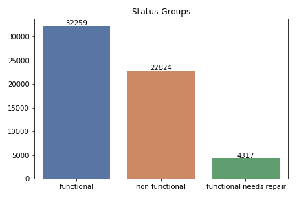

## Tanzanian Water Well Prediction 
#### Authors: Ryan Reilley and Kevin McDonough 

### Overview
This project analyzes data for over 74,000 water wells that have been installed in Tanzania over the years. The goal of this analysis is to determine what features of a water well provide a good prediction if the well is functional, not functional, or functional but needs repair. This will be done through exploratory data analysis and iterative predictive modeling using classification models.

### Business Problem
The Tanzania Ministry of Water have hired us to predict the operating condition for wells in their country. They will use our analysis to send teams of people out to fix the waterpoints that are currently not functional or need repair. Based on our analysis, we are going to provide reccomendations based on the following.

* Which wells you should start fixing first based on location
* Which funders and installers to focus on when building new wells
* Which type of wells should be used to replace non-functional wells

### Data Understanding 
Each row in this dataset represents a unique water well in Tanzania and surrounding information about the well. There are 59,400 rows in the training data set and 14,850 rows in the test data set. The target feature we will be predicting on is "status_group." Status_group represents the functionality of the well and there are three classes: "functional," "non functional" and "functional needs repair." There are a number of columns related to geo location of the well. There is also a good mix of continuous and categorical variables in the dataset. Each feature and its description is listed below. The different predictors are listed in the table below:

| Feature | Description|
|:-------| :-------|
|amount_tsh| Total static head (amount water available to waterpoint)|
|date_recorded| The date the row was entered|
|funder| Who funded the well|
|gps_height| Altitude of the well|
|installer| Organization that installed the well|
|longitude| GPS coordinate|
|latitude| GPS coordinate|
|wpt_name| Name of the waterpoint if there is one|
|num_private| No info for this column|
|basin| Geographic water basin|
|subvillage| Geographic location|
|region| Geographic location|
|region_code| Geographic location (coded)|
|district_code| Geographic location (coded)|
|lga| Geographic location|
|ward| Geographic location|
|population| Population around the well|
|public_meeting| Whether a public meeting was held in the village about WP management|
|recorded_by| Group entering this row of data|
|scheme_management| Who operates the waterpoint|
|scheme_name| Who operates the waterpoint|
|permit| If the waterpoint is permitted|
|construction_year| Year the waterpoint was constructed|
|extraction_type| The kind of extraction the waterpoint uses|
|extraction_type_group| The kind of extraction the waterpoint uses|
|extraction_type_class| The kind of extraction the waterpoint uses|
|management| How the waterpoint is managed|
|management_group| How the waterpoint is managed|
|payment| What the water costs|
|payment_type| What the water costs|
|water_quality| The quality of the water|
|quality_group| The quality of the water|
|quantity| The quantity of water|
|quantity_group| The quantity of water|
|source| The source of the water|
|source_type| The source of the water|
|source_class| The source of the water|
|waterpoint_type| The kind of waterpoint|
|waterpoint_type_group| The kind of waterpoint|

### Methods
* Preliminary data cleaning, exploratory data analysis and feature engineering to identify and create features that will generate accurate predictions
* scaling and fitting data to multiple classification models using pipelines  
* Evaluating model performance using selected metrics and tuning hyperparameters to maximize accuracy and micro-precision 
* Selecting final model and creating predictions for testing data

### Exploratory Data Analysis and Feature Engineering 

The chart above shows us the counts for each over our target classes. We have a bit of a class imbalance issue in that "functional needs repair" is a small percentage of the dataset. Knowing this, we will use resampling methods when creating our model. 

We created a column called "age" that takes the "date_recorded" column and subtracts the "construction_year" column and graphing this showed us that non functional wells tended to be older. Because there was a lot of data points missing in the "construction_year columns, we also created a new column which binned age into decades and created an "unknown" category for missing values. In order to visualize the relationship between different numerical and categorical variables with our target variable, we created a dashboard that allowed us to select different features via dropdown.

The image above shows the output of the dashboard. On the left is a dropdown for categorical features and on the right is a dropdown for numerical features. For the categorical features, we showed the percentage breakdown of each status group on a horizontal barchart. For numerical variables, we created a boxplot that shows status group versus the selected variable. In the boxplot above, we are showing our engineered "age" feature. The categorical variable currently shown is "water_quality." Looking at that chart, you can see that a high percentage of fluoride wells are functional, whereas, if water quality is unknown, a higher percentage are non functional. 
