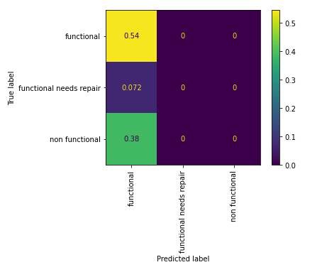
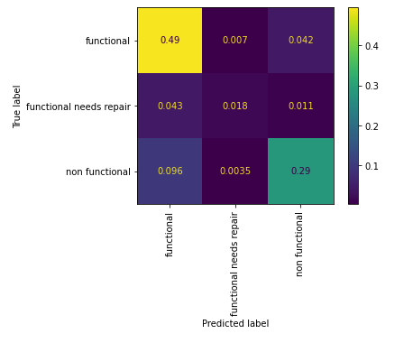

## Tanzanian Water Well Prediction 
#### Authors: Ryan Reilley and Kevin McDonough 


### Overview
This project analyzes data for over 74,000 water wells that have been installed in Tanzania over the years. The goal of this analysis is to determine what features of a water well provide a good prediction if the well is functional, not functional, or functional but needs repair. This will be done through exploratory data analysis and iterative predictive modeling using classification models.

### Business Problem
The Tanzania Ministry of Water have hired us to predict the operating condition for wells in their country. They will use our analysis to send teams of people out to fix the waterpoints that are currently not functional or need repair. Based on our analysis, we are going to provide reccomendations based on the following.

* Which wells you should start fixing first based on location
* Which funders and installers to focus on when building new wells
* Which type of wells should be replaced based on age

### Data Understanding 
Each row in this dataset represents a unique water well in Tanzania and surrounding information about the well. There are 59,400 rows in the training data set and 14,850 rows in the test data set. The target feature we will be predicting on is "status_group." Status_group represents the functionality of the well and there are three classes: "functional," "non functional" and "functional needs repair." There are a number of columns related to geo location of the well. There is also a good mix of continuous and categorical variables in the dataset. Each feature and its description is listed below. The different predictors are listed in the table below:

| Feature | Description|
|:-------| :-------|
|amount_tsh| Total static head (amount water available to waterpoint)|
|date_recorded| The date the row was entered|
|funder| Who funded the well|
|gps_height| Altitude of the well|
|installer| Organization that installed the well|
|longitude| GPS coordinate|
|latitude| GPS coordinate|
|wpt_name| Name of the waterpoint if there is one|
|num_private| No info for this column|
|basin| Geographic water basin|
|subvillage| Geographic location|
|region| Geographic location|
|region_code| Geographic location (coded)|
|district_code| Geographic location (coded)|
|lga| Geographic location|
|ward| Geographic location|
|population| Population around the well|
|public_meeting| Whether a public meeting was held in the village about WP management|
|recorded_by| Group entering this row of data|
|scheme_management| Who operates the waterpoint|
|scheme_name| Who operates the waterpoint|
|permit| If the waterpoint is permitted|
|construction_year| Year the waterpoint was constructed|
|extraction_type| The kind of extraction the waterpoint uses|
|extraction_type_group| The kind of extraction the waterpoint uses|
|extraction_type_class| The kind of extraction the waterpoint uses|
|management| How the waterpoint is managed|
|management_group| How the waterpoint is managed|
|payment| What the water costs|
|payment_type| What the water costs|
|water_quality| The quality of the water|
|quality_group| The quality of the water|
|quantity| The quantity of water|
|quantity_group| The quantity of water|
|source| The source of the water|
|source_type| The source of the water|
|source_class| The source of the water|
|waterpoint_type| The kind of waterpoint|
|waterpoint_type_group| The kind of waterpoint|

### Methods
* Preliminary data cleaning, exploratory data analysis and feature engineering to identify and create features that will generate accurate predictions
* scaling and fitting data to multiple classification models using pipelines  
* Evaluating model performance using selected metrics and tuning hyperparameters to maximize accuracy and micro-precision 
* Selecting final model and creating predictions for testing data

### Exploratory Data Analysis and Feature Engineering 


The chart above shows us the counts for each over our target classes. We have a bit of a class imbalance issue in that "functional needs repair" is a small percentage of the dataset. Knowing this, we will use resampling methods when creating our model. 

We created a column called "age" that takes the "date_recorded" column and subtracts the "construction_year" column and graphing this showed us that non functional wells tended to be older. Because there was a lot of data points missing in the "construction_year columns, we also created a new column which binned age into decades and created an "unknown" category for missing values. In order to visualize the relationship between different numerical and categorical variables with our target variable, we created a dashboard that allowed us to select different features via dropdown.


The image above shows the output of the dashboard. On the left is a dropdown for categorical features and on the right is a dropdown for numerical features. For the categorical features, we showed the percentage breakdown of each status group on a horizontal barchart. For numerical variables, we created a boxplot that shows status group versus the selected variable. In the boxplot above, we are showing our engineered "age" feature. The categorical variable currently shown is "water_quality." Looking at that chart, you can see that a high percentage of fluoride wells are functional, whereas, if water quality is unknown, a higher percentage are non functional. 

We also mapped the locations for functional and non functional wells using folium and noticed that geography is an important feature. We have several geographical features such as latitude, longitude and region. The map below shows where the functional and non functional wells are located. We have circled areas in which we noticed areas where there appear to be many more non functional wells than functional wells. cmparison 


### Model Creation and Evaluation  

After preprocessing our data, we created a dummy matrix in which our model predicts "functional" (the majority class) for every well. The confusion matrix below shows the output of predictions for that model. 



Next we created several classification models and evaluated accuracy using cross-validation. The models we tested and there corresponding accuracy scores are listed below:

* Logistic Regression, accuracy: .73 
* Decision Tree Classifier, accuracy: .75
* **Random Forest Classifier, accuracy: .79**
* K-Nearest Neighbors, accuracy: .76
* Support Vector Machines, accuracy: .77
* **XGBoost, accuracy: .79** 

Because our Random Forest model and XGBoost model had the highest accuracy scores, we decided to select these to use moving forward. Next, we wanted to see which models did the best job of maximizing functional precision. In this scenario, we do not want our model to predict wells as "functional" when they are not. In this scenario, people would lack access to water because the well isn't working and we aren't doing anything to remedy the situation due to the fact that our model predicted that there was nothing wrong with the well. 

##### Random Forest Confusion Matrix


##### XGBoost Confusion Matrix


Looking at the output of the confusion matrices for our Random Forest Model and XGBoost model, you can see that the Random Forest model incorrectly predicts "non functional" and "functional needs repair" wells as "functional" at a lower rate than the XGBoost model (the two boxes at the bottom of the left column). Further corraborating this, we looked at the classification reports for each model and noticed that the Random Forest Model had a higher functional precision than the XGBoost model (.81 versus .78). Due to this, we decided to use the Random Forest model. 

After selecting our classification model, we wanted to optimize the model for the metric we deemed most important metric. As we discussed above, we want to minimize instances in which the model predicts that wells are functonal when they are not. To achieve this, we would like to maximize micro-precision true "functional" predictions / (true "functional" predictions + false positive "functional" predictions). In order to achieve this, we ran another grid search using different hyperparameters in order to optimize micro-precision. 


The image above shows us the confusion matrix for our final model after optimizing for micro precision. Comparing this to our base models, you can see that the values in the two lower boxes on the left column are lower than they were previously. Additionally, on the classification report, the functional precision improved from .81 to .82 without causing a decrease in accuracy (still .79).

We also charted the most important features of our model to get a better sense of what features led to a well being non functional: 


Our last step was to take our final model, fit it on our testing data and use it to create predictions. We did this and then mapped the "non functional" predictions on folium so we could figure out which locations to begin fixing wells. 


In the map above we circled areas in which we noticed high counts of predicted non functional wells. 

### Conclusions 

**1. Start fixing wells that are non-functional and located where the counts are the highest .** We looked at where every non-functional well is located on a map. We could start where the clusters were the highest. 

**2. Recommend replacing non-functional wells with the top installers.** One of the top predictors of the status group of the well was the installer count, which showed the number of installs by each installer company. Consider using a top installer for replacing non-functional wells. 

**3. Consider replacing older wells.** Most functional wells are under 20 years old. Consider looking at the age of the well to determine if it is non-functional.

### Next Steps

Further analyses could provide even more insight into how we can predict the operating condition of wells in Tanzania: 

**More features of the wells** Other features that could indicate a functioning well include usage rate (how often it gets used in a given day/week and month), proximity to nearest subvillage, 

**Better idea of populations of specific regions.** There was a lot of missing data that we had to impute for the population feature. If we could gather actual population estimates through a thorough census, we could then determine which wells to focus on first. Those wells that are non-functioning in a larger populated area would be highest priority.

**Better idea of when the well was contructed.** THis was another column of  a lot of missing values. If we could gather more information on the contruction year of the well based on geological surveys, we can determine how much longer a well will last before it becomes non-functional.

**Implement new technology for functionality tracking.** We could implement sensors on all the wells to determine if they are being used. We may be able to also capture satellite images of the wells to see if they are being used. 

### For More Information:
Please review our full analysis in our [Final Notebook](./final_notebook.ipynb), our [Images](./images), our [Presentation](./final_presentation_phase_3.pdf)   
and our [Dashboard Code](./working_notebooks/dashboard_code.py). 

For any additional questions, please contact Ryan Reilley and Kevin McDonough

Ryan: 
Email: ryan.m.reilly@gmail.com
Github: https://github.com/ryanreilly
Linkedin: https://www.linkedin.com/in/ryanreilly1/

Kevin: 
Email: kpmcdonough@gmail.com
Github: https://github.com/KPMcDonough49
Linkedin: https://www.linkedin.com/in/kevin-mcdonough-01466a178/

### Competition Results 

After we evaluated our model we preprocessed the testing set (which didn't contain the target column) and generated predictions for those wells. We then submitted our results to the competition here [Here](https://www.drivendata.org/competitions/7/pump-it-up-data-mining-the-water-table/). Below is the summary of our submission results: 


It looks like we landed in the top 25% of all competitors, which is a good first try. Many teams submitted more than one. 


### Repo Structure
```
├── data
│   ├── dash_df.csv
│   ├── X_test.csv
│   ├── X_train.csv
│   └── y_train.csv
|
├── images
│   ├── age_hist.png
│   ├── altitude.png
│   ├── comparison_maps.png
│   ├── dashboard_output.png
│   ├── dummy_matrix.png
│   ├── feature_importance.png
│   ├── final_model_confusion.png
│   ├── HappyKid_well.jpeg
│   ├── installer_groups.png
│   ├── outcome_classes.png
│   ├── predicted_non_functional.png
│   ├── random_forest_confusion.png
│   ├── sales_per_waterfront.png
│   ├── smart.gif
│   ├── status_group_by_age.png
│   ├── Submission.png
│   ├── top_installers.png
│   ├── water_quality.png
│   ├── waterpoint_type.png
│   └── XGBoost_confusion.png
|
├── src
│   └── preprocessing.py
|
├── working_notebooks
│   ├── Kevin's Working Notebook.ipynb
│   ├── ryan_notebook.ipynb
│   └── dashboard_code.py
|
├── .gitignore
├── CONTRIBUTING.md
├── LICENSE.md
├── README.md
├── final_notebook.ipynb
├── final_predictions.csv
└── final_presentation_phase_3.pdf
```
